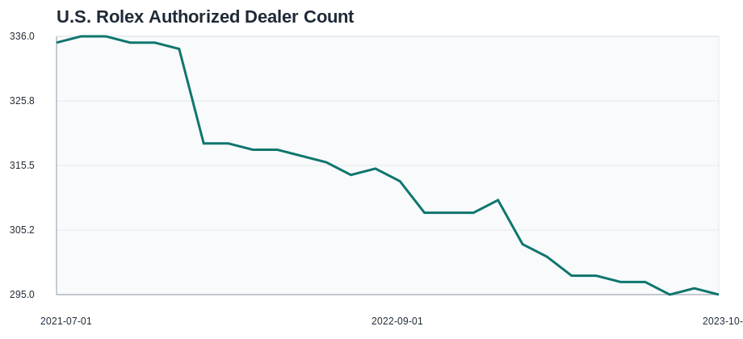
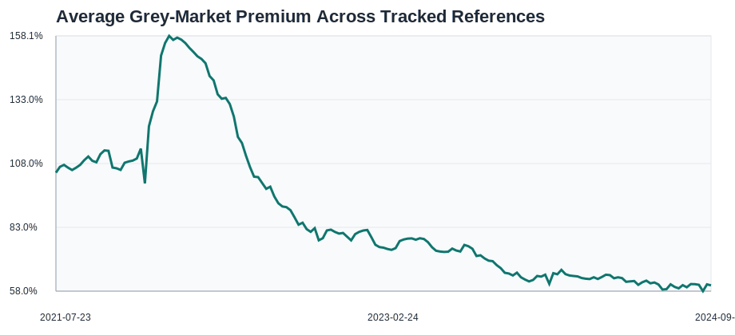

# Monthly Market Summary

## Coverage

- AD snapshots cover **2021-07-01** through **2023-10-01**.
- Grey-market pricing covers references through **2024-09-13**.

## Dealer Network Snapshot

- U.S. authorized dealer count moved from **335** to **295** (-11.94%).
- Net dealer change over the observed AD period: **-40** stores.

Top states in the latest AD snapshot:
- California: 33 dealers
- Florida: 27 dealers
- Texas: 25 dealers
- New York: 21 dealers
- Illinois: 13 dealers

## Grey-Market Snapshot

- Highest latest premium in the tracked reference set: **126710BLRO (GMT-Master II)** at **117.43%**.
- Lowest latest premium in the tracked reference set: **126622 (Yacht-Master)** at **28.25%**.

## Data Quality

- Snapshot months with at least one QC flag: **10** of **28**.
- Largest descriptive same-month AD-count/markup correlation in the overlap period: **124270** at **0.9483**.
- Correlation outputs are descriptive only and should not be treated as causal evidence.

## Figures

